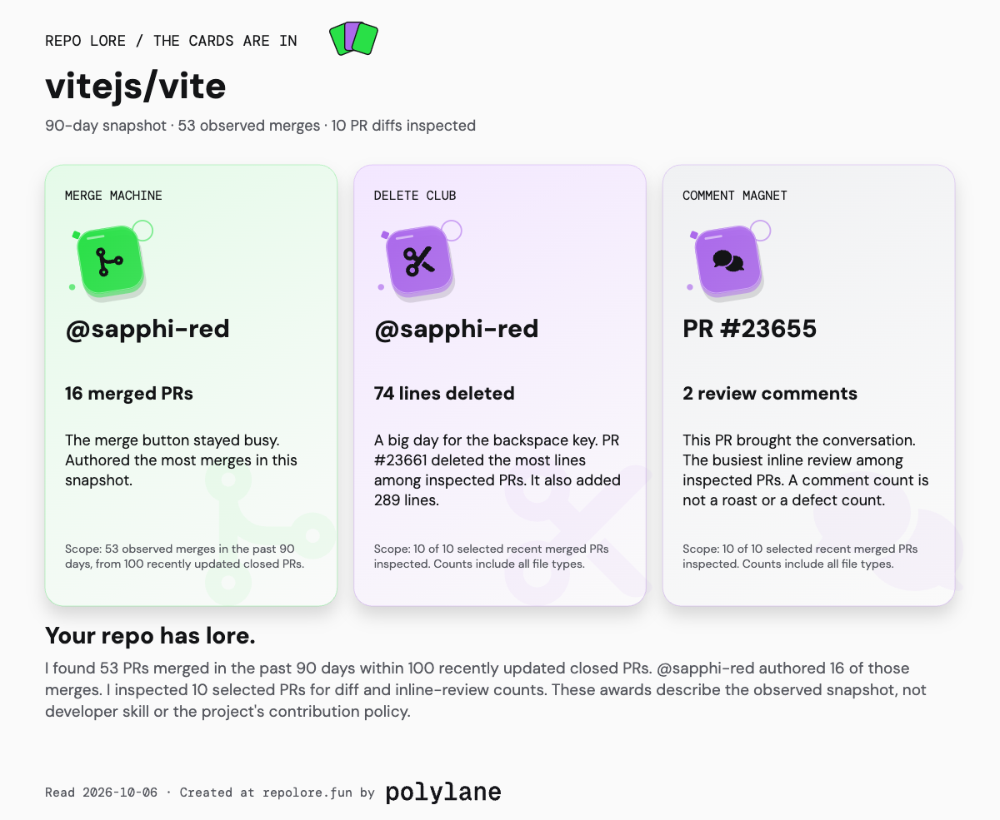

#  Repo Lore

The merge machines, delete legends, and main characters behind a GitHub repo.

Paste `owner/repo` or a GitHub URL. The result lives at
`repolore.fun/owner/repo`: copy that URL to pass it around. Each award links to a
leaderboard comparing snapshots from popular repositories and to the source PRs.

[repolore.fun](https://repolore.fun) currently requires Coreplane Cloudflare SSO.
The source and local app are public. Search engines and social preview crawlers
cannot pass that SSO gate; the canonical pages and PNG previews are ready for a
public launch when the gate is removed.



## Run locally

Use Node 22 or later and Bun for development dependencies.

```sh
bun install --frozen-lockfile
bun run build
bun run dev
```

Open http://127.0.0.1:4178. Repo pages, leaderboards, avatars, and PNG previews
use the same local server as the hosted Worker. Set `REPO_ARCADE_PORT` to choose
another port. Saved snapshots live in `.data`, which is ignored by Git.

## What the awards mean

| Award | Measurement |
| --- | --- |
| Merge Machine | Author with the most observed merges in the snapshot |
| Delete Club | Largest deletion on one inspected merged PR; additions stay visible |
| Comment Magnet | Most inline review comments on one inspected merged PR |
| The Cast | Distinct author accounts, including bots; top three photos and a rest count |
| The Long Goodbye | Oldest open PR by calendar age |
| Fastest Lap | Shortest observed interval between PR opening and merge |

These do not measure developer skill, AI authorship, or contribution policy.
They use bounded 90-day snapshots, not lifetime totals. The main-character
standings use authored merges; clicking the merge button is a different action.
Bot participation uses GitHub's account type, not an authorship guess.

Cross-repo leaderboards compare each repo's observed winning value. Delete Club
compares **one PR**, not a person's total deleted lines. Every row keeps its PR
link, read date, and inspected count. Some repositories have fewer than ten
eligible inspected merges. See [METHOD.md](METHOD.md) for calculations and limits.

## Pages and previews

- `/owner/repo`: server-rendered result, canonical URL, repo identity, and metadata.
- `/leaderboards/delete`: cross-repo Delete Club; the other five categories have pages too.
- `/_og/owner/repo.png?v=<capture timestamp>`: a 1200 × 630 PNG for that snapshot.
- `/_avatar/u/<id>` and `/_avatar/in/<app-id>`: bounded GitHub photo proxies.
- `/sitemap.xml`: known popular repo pages and leaderboard pages.

The page and its preview use the same saved facts. Titles, descriptions,
`og:image`, Twitter large-image metadata, and structured data are emitted before
JavaScript runs. GitHub's repo-owner avatar supplies repo identity. Contributor
portraits preserve the API's user or app avatar source. Missing photos get a
simple fallback; they do not affect scores.

Previews use local DM Sans font buffers and resvg WASM. The design avoids costly
SVG blur filters, and rendered PNGs are reused in each Worker isolate. No font
CDN, browser screenshot service, or inference provider is required.

## GitHub data and caching

A read checks public metadata first, then reads up to 100 recently updated
closed PRs, the 30 oldest open PRs, and details for up to ten selected recent
merges. At most 14 GitHub requests run with two diff reads at a time. A 24-second
deadline and eight-million-character response cap bound the scan. Private repos
are rejected even when a server credential is configured.

Indexed repos reuse their saved snapshot; the scheduler refreshes the index.
An on-demand repo uses a 15-minute temporary cache and is not added to the index.
If GitHub is temporarily unavailable or rate-limited, an existing snapshot can
still be shown with its original date and a note. An unknown repo without a
snapshot gets a plain error. Indexed versioned OG snapshots expire after seven days; temporary ones after
fifteen minutes;
an expired version never silently uses different facts.

Anonymous GitHub quota is limited by source IP. A public-read GitHub credential
can be configured as a Worker secret for a larger quota. It stays on the server,
is sent only to GitHub's API, and never goes to browsers, avatars, HTML, or cache.
Local development uses `REPOLORE_GITHUB_TOKEN` only when explicitly provided.
No runtime reads the developer's GitHub CLI login or switches credentials.

## Populate comparisons

This is an explicit maintainer operation using the existing `gh` login for
public reads. It never changes a repository or stores the credential.

```sh
bun run build
bun run capture --popular
bun run seed
wrangler kv bulk put .data/seed.json --binding REPORTS --remote
```

The starting baseline is in `src/catalog.ts`. A single repo can be captured with
`bun run capture owner/repo`. Leaderboard views read saved comparisons.

With a dedicated `GITHUB_TOKEN`, a fifteen-minute Worker cron refreshes up to
four repos per run. Each day it discovers up to 100 public, non-fork, non-archived
repos with the most stars. A full 100-repo pass takes about 6.25 hours. It retains
up to 90 daily readings; same-day captures replace that day rather than creating
fake history. Trending selects up to 20 indexed repos by positive net star growth
over up to seven days. Top stars uses the discovered shortlist. Both groups rank
the selected award, not stars. Until discovery and a second daily reading exist,
the UI names the curated baseline and warming state. Without a token the cron
does no GitHub reads. An arbitrary queried repo is compared against the index,
but is not permanently added to it.

Repo graphs show human/bot merge shares, sampled daily merge activity, actual
star readings, and the repo's Comment Magnet comparison. Unknown accounts stay
separate. Missing days and history are not fabricated.

## For terminal users and agents

```sh
node scripts/report.mjs owner/repo
node scripts/report.mjs owner/repo --json
node scripts/report.mjs --input saved-evidence.json
```

JSON contains the plain-language summary, awards, coverage, and normalized
source facts. Show the summary and source links, and retain scope when quoting
numbers. Replay reproduces saved facts offline; it does not verify them against
GitHub. The CLI uses public anonymous reads and performs no repository writes.

## Development and hosting

```sh
bun run build
bun run typecheck
bun run test
```

Tests stay offline with injected fetch, storage, clock, and rendering boundaries.
Build before typecheck: CLI entry points consume compiled modules. Browser and
real PNG checks are separate. [RESEARCH.md](RESEARCH.md) records design references;
[DEPLOYMENT.md](DEPLOYMENT.md) covers account binding, KV, secrets, and SSO.

Light, Dark, and System themes use local fonts. The green values are CSS tokens:
light `#29E047`, dark `#3FF35D`. Motion respects reduced-motion preferences.
The footer credits Polylane: built for fun.

## License

Code is MIT-licensed. Fonts, icons, and the PNG renderer retain their licenses;
GitHub photos retain their owners' rights. See [THIRD_PARTY.md](THIRD_PARTY.md).
The package remains private on npm with a publication refusal.
